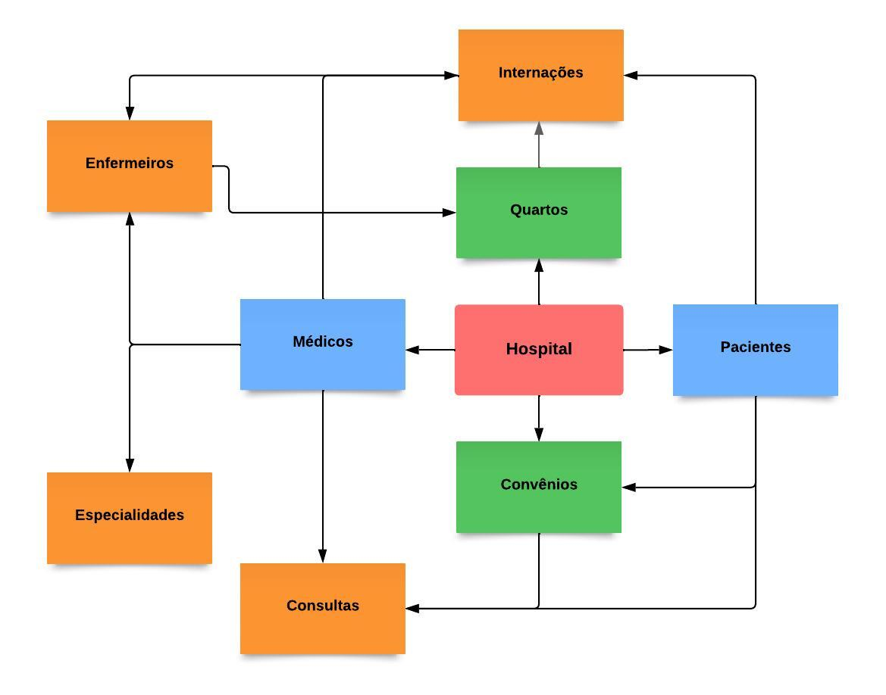

# Parte 1

## Requisitos

Médicos: ["Especialistas", "Residentes", "Generalistas"]
Médicos: Especialidades >= 1
Médicos: Permite a inserção de novos dados.

Convênio: {Nome: "exemplo", CNPJ: "ex3mplo", tempo_carência: "exemplo"}

Consultas: As consultas possuem Data e Hora de realização, médico responsável, paciente, valor ou nome do convênio, número da carteira e a especialidade da consulta
Consultas: Ao finalizar uma consulta, deve ser possível adicionar os medicamentos prescritos, quantidade e as instruções de uso
Consultas: Deve ser impresso um relatório sobre a receita, e permitir sua visualização através da internet
* 
* 
* Dados pessoais = nome, data de nascimento, endereço, telefone, e-mail, CPF, RG

# Diagrama

Nesse diagrama, mantenho visível cada relação do banco de dados em que trabalhei, mostrando quais coleções estão se comunicando e utilizando dados entre si.
As cores na tabela representam o nivel de proximidade ao hospital em si, sendo azul o mais próximo e laranja o mais distante.
